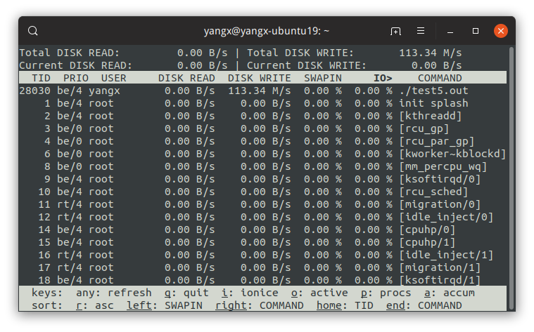

# Log

## Introduction
前后端分离.

### 前端
前端供应用程序使用, 生成单条 log message. 每条日志的信息包括时间戳, 源文件位置与行号, 还包括客端的数据等. 使用 logstream 进行了行缓冲, 所以每条日志都创建一份单独的 buffer, 并且控制格式转换等相关内容. 在每条日志结束时, 会写到 AsyncLogger 的前端数据缓冲区中.
目前可以设置是否激活 Logger, 输出文件/STDOUT, LOG/DEBUG LOG 等. 在不激活日志库或使用标准输出的情况下, 不会静默启动后端线程.
前端是直接提供给网络库使用的, 那么与网络库本身或者任意的应用程序一样, 打log的时候就不能出现任何的延迟/阻塞.

### 后端
后端利用单独的线程负责将日志信息写到文件中.

后端的异步日志线程在日志系统激活的情况下是静默启动的.
使用了双缓冲技术, 前端与后端使用不同的 buffer, 必要时进行切换. 避免争用.

## 组件

### move
移动语义,  对于智能指针来说, 如 shared_ptr, 此动作直接转移对象的所有权, 被转移者不管理对象. 相当于 reset( ).
前后端的 buffer 交换是利用 move 交换 share_ptr 所管理的资源.

## TODO
-[ ] 目前切换输出位置以及输出级别只是简单的用条件宏判断了一下, 需要完善.
-[ ] 缺少更详细的日志级别.

## 测试
开启 4 个测试线程 + 主线程, 一起不间断的写 log, 后端输出到文件中. 写入磁盘的速度大概在 110 M/s 上下, 但此时 CPU 利用率远还没有达到 100%. 需要进一步测试.

